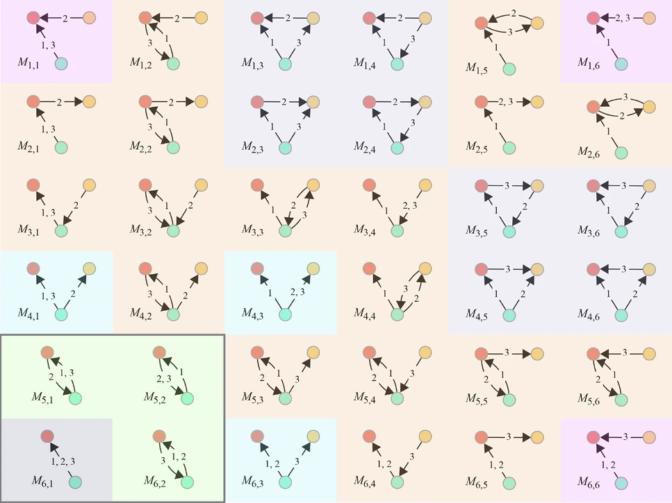

# Detecting Suspicious Activity in the NFT Ecosystem using Temporal Graph Analysis
This is the code for **[Detecting Suspicious Activity in the NFT Ecosystem using Temporal Graph Analysis](https://github.com/slitiWassim/NFT-Suspicious-Activity)** .

### [Project](https://slitiwassim.github.io/NFT-Suspicious-Activity/) | [Dataset](https://drive.upm.es/s/sLgeSrNxMEzXaEB?openfile=true) | [Paper]()
 

## Framework Overview

<a href="static/images/framework_TKG.jpg" target="_blank">
    <image src="static/images/framework_TKG.jpg" width="100%">
</a>


## Setup
The code can be run under any environment with Python 3.12 and above.
(It may run with lower versions, but we have not tested it).

Install the required packages:

    pip install -r requirements.txt
  
Clone this repo:

    git clone https://github.com/slitiWassim/NFT-Suspicious-Activity.git
    cd NFT-Suspicious-Activity/

##  Data Collection and Preparation


<p align="center">
  <a href="static/images/data_collection_preparation.jpg" target="_blank">
    
  </a>
</p>


A dataset is a directory with the following structure:
  ```bash
  $ tree data
  NFTs_Dataset
  ├── mapping
  │   ├── nft_id_mapping
  │   └── wallet_id_mapping
  │
  ├── collections.csv
  └── opensea_nft_transactions.parquet
  
  
  ```

### Data description
| Descriptions | Statistics                                                                                  |
|--|---------------------------------------------------------------------------------------|
|Start date(dd-mm-yyyy,UTC) | 23-06-2017 21:05 |
|End date (dd-mm-yyyy, UTC)| 22-12-2023 19:06 |
|Number of NFT collections | 1,746,379 |
|Number of NFT tokens |41,292,572 |
|Number of account addresses| 7,062,831 |
|Number of transactions |76,300,244  |
|Chains | 10 |


## Temporal Cycles Detection
In this study, we conducted a temporal cycle-driven analysis to identify groups of interconnected traders, and then examined the rhythm, ordering, and frequency of their transactions within these cycles to uncover patterns that deviated from normal market activity.

<a href="static/images/temporal_cycles.png" target="_blank">
    <image style="border: 2px solid rgb(201, 196, 196);" src="static/images/temporal_cycles.png" width="100%">
</a>

Illustrative example of temporal cycle extraction from a temporal graph. 
- ($\textbf{a}$)  is an example of a temporal cycle $(a \rightarrow b \rightarrow c \rightarrow d \rightarrow a)$. 
- ($\textbf{b}$) Temporal graph with edges annotated by their corresponding timestamps. 
- ($\textbf{c}$) A valid temporal cycle $(a \rightarrow b \rightarrow c \rightarrow d \rightarrow a)$ instance within the temporal graph, with duration $\delta = 9$ and length $L = 4$. 
- ($\textbf{d}$) A structurally valid directed cycle that fails to satisfy temporal ordering, and therefore does not qualify as a temporal cycle.


### 1) Strongly Connected Components decomposition

Following the implementation of [Johnson’s algorithm](https://epubs.siam.org/doi/abs/10.1137/0204007) ,  the search is restricted to Strongly Connected Components .
Strongly Connected Components (SCCs) are identified using [**Raphtory**](https://docs.raphtory.com/en/v0.16.3/) built-in method.  


<p align="center">
  <a href="static/images/scc.svg" target="_blank">
    
  </a>
</p>


### 2) Johnson cycle search

Running the algorithm by examining cycles from every temporal edge individually would cause an exponential increase in complexity due to the vast number of temporal edges in temporal graphs. To improve efficiency, we instead focus on identifying **potentially temporal cycles**. This is achieved by locating structural cycles where consecutive edges $e_t$​ and $e_{t+1}$​ satisfy the temporal consistency condition  $min⁡(e_t.\tau)<max⁡(e_{t+1}.\tau)$.

This filtering step significantly reduces the search space while preserving cycles that are likely to be temporally valid.

Within each strongly connected component (SCC), an **adapted Johnson backtracking algorithm** is then employed to enumerate structural cycles. Each candidate cycle undergoes **early pruning** through an interval compatibility check ,to ensure temporal feasibility between consecutive edges.

### 3) **Cycle validation**

Each candidate (structural) cycle is passed through `validate`, which performs a fine grained temporal validation  by checking for a strictly **increasing sequence of timestamps** across edges.   Only cycles satisfying full temporal consistency are accepted.

Instead of computing the full **Cartesian product** of all timestamp combinations (which can explode combinatorially), it performs **incremental DFS pruning**:

- At each step, it picks the next timestamp that is strictly larger than the last chosen one.    
- It stops early when no valid next timestamp exists.


To run the `temporal cycles detection algorithm` on a dataset, run:
```bash
 python  extract_temporal_cycles.py --dataset </path/to/transactions-file> 
```  
 For example, to detect  `temporal cycles` with Maximum duration δ = 24 hours and Maximum cycle length L = 15:

```bash
python extract_temporal_cycles.py \
    --dataset data/nft_transactions.parquet \      # Path to the dataset
    --window "7 day" \                             # Size of the temporal rolling window
    --step "6 day" \                               # Step size between consecutive rolling windows
    --max-duration "1 day" \                       # Maximum cycle Duration
    --max-length 15 \                              # Maximum cycle length 
    --num-processes 8                              # Number of parallel processes (1 = sequential execution)

```


## Suspicious Activity Detection 
Please note that, in order to detect suspicious trading activities, temporal trading cycles must be detected first; alternatively, you can download pre-detected cycles from [here](https://drive.upm.es/s/7xRHTdFwCT2D5Ga)

To identify suspicious trading activities within transactional data, run the following:

```bash
python suspicious.py \ 
    --dataset </path/to/transactions-file>  \
    --cycles  </path/to/cycles_data> 
```      
 
 For example :

```bash
python suspicious.py \
    --dataset data/nft_transactions.parquet \
    --cycles cycles_data

```
Flagged suspicious trading activities will be saved in the `output/results` directory.

## Temporal Motif-based Characterization 

To investigate the wallets flagged as suspicious and better understand their trading behavior despite the lack of labeled data, we conduct a temporal motif analysis. This method helps us identify recurring transaction patterns and interaction structures, compare them with normal trading behavior in the broader ecosystem, and
provides additional evidence supporting the anomalous or
potentially illicit nature of these wallets activities.

<a href="static/images/motifs_example.png" target="_blank">
    <image style="border: 2px solid rgb(201, 196, 196);" src="static/images/motifs_example.png" width="100%">
</a>

An example of extracting a particular temporal motif from a temporal graph. ($\textbf{a}$) is an example of $\delta$-temporal motif $M$ with a given $\delta$ = 10; ($\textbf{b}$) is a temporal graph with edges appearing at the times shown on
each edge; ($\textbf{c}$) shows an instance of $\delta$-temporal motifs in the temporal graph; ($\textbf{d}$) is not a $\delta$-temporal motif
because the difference between the timestamp of the first temporal edge and the timestamp of the last temporal
edge exceeds the given $\delta$


<p align="center">
  <a href="static/images/possible_motifs.png" target="_blank">
    
  </a>
</p>


Our Temporal Motif-based Characterization is based on the work of [Naomi et al.](https://www.nature.com/articles/s41598-024-75348-7) and has been adapted as a validation approach to address the lack of labeled data, effectively demonstrating the unusual trading behavior of flagged traders.


```bash
python motifs.py \ 
    --dataset </path/to/transactions-file>  \
    --nodes  </path/to/suspicious-wallets> 
```  

 For example :

```bash
python motifs.py \
    --dataset data/nft_transactions.parquet \
    --nodes output/results

```
Temporal Motif-based Characterization will be saved in the `output/motifs` directory.


## Citing
If you find our work useful, please consider citing:
```BibTeX
Paper submitted 

```

## Contact
For any question, please file an [issue](https://github.com/slitiWassim/NFT-Suspicious-Activity/issues) or contact:

    Wassim Sliti : wassim.sliti@upm.es

## Acknowledgement

This work was carried out within the STRAST Research Group at the Information Processing and Telecommunications Center (IPTC), Universidad Politécnica de Madrid, as part of the [ CEDAR ](https://cedar-heu-project.eu/)   project, funded by the Horizon Europe Programme (Grant Agreement No. 101135577). 